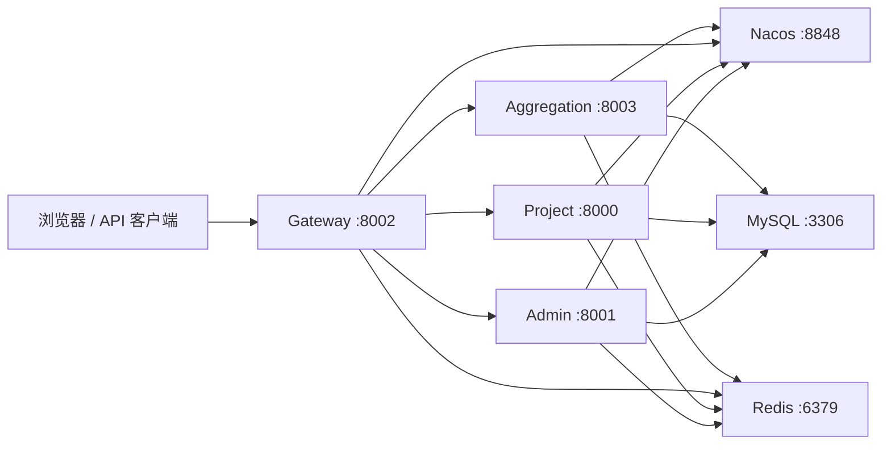

# SaaS 短链接系统（Java 后端）

基于 Java 与 Spring Cloud 构建的短链接后端服务，覆盖用户与分组管理、短链接生成与跳转、访问统计、缓存治理、分库分表、网关鉴权，以及聚合部署和微服务部署两种运行方式。

> **项目来源**：本仓库基于 [NageOffer ShortLink](https://github.com/nageoffer/shortlink) 进行功能扩展与工程化调整，遵循 Apache License 2.0。具体许可信息见 [`LICENSE`](LICENSE)。

## 核心能力

- 用户注册、登录、令牌校验与用户信息管理
- 短链接创建、修改、分页查询、批量创建与 302 跳转
- 短链接分组、回收站和有效期管理
- PV、UV、UIP、地区、设备、浏览器、操作系统和网络类型统计
- Redis 缓存、分布式锁、布隆过滤器与缓存穿透治理
- ShardingSphere-JDBC 分表
- Sentinel 接口限流
- Spring Cloud Gateway 统一入口和登录态校验
- Nacos 服务注册与发现
- Admin 与 Project 聚合部署
- Actuator + Prometheus 指标暴露

## 系统架构



系统支持两种运行方式：

- **微服务模式**：分别启动 `admin`、`project` 与 `gateway`，通过 Nacos 完成服务发现。
- **聚合模式**：使用 `aggregation` 将 Admin 与 Project 能力运行在同一 JVM 中，适用于本地开发和单机部署。

## 模块说明

| 模块 | 默认端口 | 职责 |
| --- | ---: | --- |
| `admin` | 8001 | 用户、分组、回收站、管理端接口及远程调用封装 |
| `project` | 8000 | 短链接创建、跳转、缓存、布隆过滤器与访问统计 |
| `gateway` | 8002 | 统一 API 入口、路由转发、Token 校验 |
| `aggregation` | 8003 | 聚合 Admin 与 Project，支持一体化部署 |

## 技术栈

- Java 22
- Spring Boot 3.2.10
- Spring Cloud 2023.0.3
- Spring Cloud Alibaba 2023.0.1.2
- MyBatis-Plus 3.5.9
- ShardingSphere-JDBC 5.5.2
- MySQL、Redis、Redisson、Nacos、Sentinel
- Maven 多模块工程

## 快速启动

### 1. 环境要求

- JDK 22
- Maven 3.9+
- MySQL 8.x
- Redis 6+
- Nacos 2.x

检查本地开发环境：

```powershell
powershell -ExecutionPolicy Bypass -File .\scripts\environment-check.ps1
```

### 2. 初始化数据库

```sql
CREATE DATABASE shortlink CHARACTER SET utf8mb4 COLLATE utf8mb4_unicode_ci;
```

```powershell
mysql -u root -p shortlink < .\resources\database\link.sql
mysql -u root -p shortlink < .\resources\database\link-data.sql
```

`link-data.sql` 包含仅用于本地开发的示例账号和默认分组。

### 3. 配置本地依赖

默认配置使用：

- MySQL：`127.0.0.1:3306/shortlink`
- Redis：`127.0.0.1:6379`
- Nacos：`127.0.0.1:8848`

如本地 MySQL 或 Redis 设置了密码，请使用本地覆盖配置，不要提交真实密码、Token 或 API Key。

地区统计需要高德开放平台 Web 服务 Key，可在 PowerShell 中临时设置：

```powershell
$env:AMAP_API_KEY = "你的高德 Web 服务 Key"
```

未配置 Key 时，短链接创建与跳转功能仍可正常使用，地区解析数据可能不完整。

### 4. 聚合模式启动

终端一：

```powershell
mvn -pl aggregation -am spring-boot:run "-Dspring-boot.run.arguments=--short-link.domain.default=localhost:8003"
```

终端二：

```powershell
mvn -pl gateway spring-boot:run
```

- 统一 API 入口：`http://localhost:8002`
- 短链接跳转地址：`http://localhost:8003/{short-uri}`

完整的本地运行说明见 [`docs/local-development.md`](docs/local-development.md)，接口示例见 [`docs/api-examples.http`](docs/api-examples.http)。

## 核心设计

### 短链接生成与跳转

短链接创建链路包含短 URI 生成、唯一性判断、数据库落库与缓存预热。跳转请求优先读取 Redis，缓存未命中时通过分布式锁和二次检查回源数据库，随后回填缓存并执行 302 跳转。

### 缓存穿透治理

系统组合使用布隆过滤器、空值标记、分布式锁和双重判定，降低无效短链接请求对数据库的压力。布隆过滤器负责快速过滤，数据库和空值缓存负责最终兜底。

### 访问统计

访问链路采集 PV、UV 与 UIP，并解析地区、操作系统、浏览器、设备和网络类型等维度。UV 使用客户端标识配合 Redis Set 去重，UIP 根据访问 IP 去重。

### 数据分片

ShardingSphere-JDBC 根据业务分片键路由用户、分组和短链接数据，降低单表数据量增长带来的查询与维护压力。

## 构建验证

```powershell
mvn clean package
```

仓库固定了 Spring Boot Maven Plugin 版本，避免 Maven 自动解析到不匹配的插件版本。

## 安全说明

- 仓库不包含真实数据库密码、Redis 密码、API Key 或生产域名配置。
- 示例账号和 AES Key 仅用于本地开发，不应在生产环境使用。
- 生产环境应通过环境变量或配置中心管理敏感配置。

## 许可

本项目基于 [NageOffer ShortLink](https://github.com/nageoffer/shortlink) 进行扩展，遵循 Apache License 2.0。详见 [`LICENSE`](LICENSE)。
